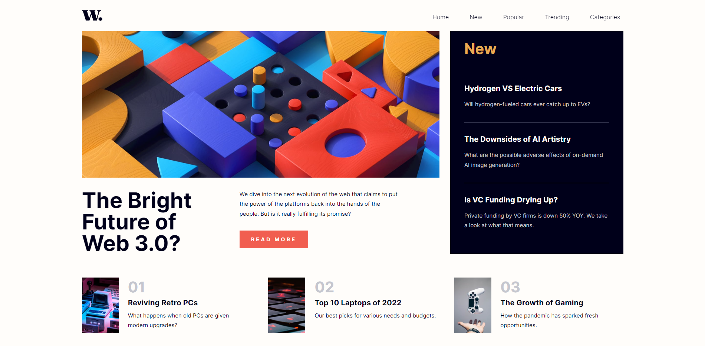

# Frontend Mentor - News homepage solution

This is a solution to the [News homepage challenge on Frontend Mentor](https://www.frontendmentor.io/challenges/news-homepage-H6SWTa1MFl). Frontend Mentor challenges help you improve your coding skills by building realistic projects. 

## Table of contents

- [Overview](#overview)
  - [The challenge](#the-challenge)
  - [Screenshot](#screenshot)
  - [Links](#links)
- [My process](#my-process)
  - [Built with](#built-with)
  - [What I learned](#what-i-learned)
- [Author](#author)

## Overview

### The challenge

Users should be able to:

- View the optimal layout for the interface depending on their device's screen size
- See hover and focus states for all interactive elements on the page

### Screenshot

### Links

- Solution URL: [Add solution URL here](https://github.com/antozr/news-home-page)
- Live Site URL: [Add live site URL here](http://www.challengefrontmentor.antoni-dumont.be/homepagenews/)

## My process

I'm starting by make the header with logo & navbar, I'm start integration with the mobil first for a easier progressing to the pc screen. I'm create the hamburger menu with differently animation for open and close.

After I've create the first section, for this I've placed the flex-wrap with the different size of compenents and the gap, I don't touch for the responsive, is good with screen width + 600px.
I've had the small transition with element in hover, for the attractivity and create the good project. 

For my facility I use the :root{} systeme in SCSS/CSS for add my color, and in the main file, I've reboot the style. 

Thank's. 🤙
### Built with

- Semantic HTML5 markup
- SASS ( scss ) for implement the BEM method 
- Flexbox
- Root systemes for simplify 
- Mobile-first workflow
- Parcel CLI for make the small "Webpack server "
- Javascript vanilla 

### What I learned

I'm learn the animation in css, with the keyframes, for create a reactive animation in parents & childrens elements. It's not simple -, but the result is good.

I'm test a new take to make a responsive navbar, and modify in js. 

## Author

- Website - [Add your name here](http://antoni-dumont.be/)
- Frontend Mentor - [@anto_dev](https://www.frontendmentor.io/profile/antozr)
- Intagram - [@anto__dev](https://www.instagram.com/anto__dev/)

